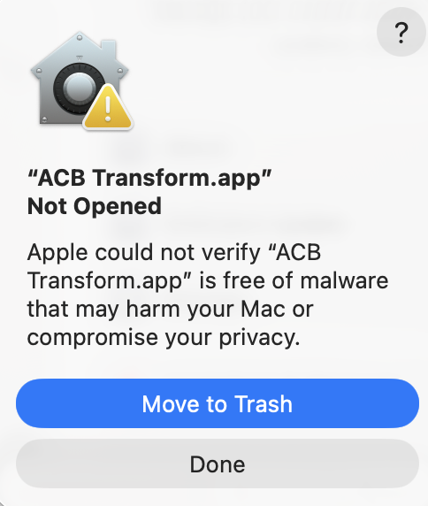
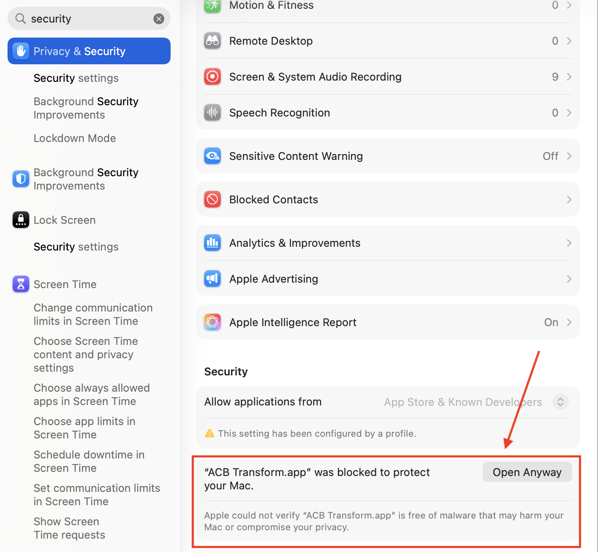
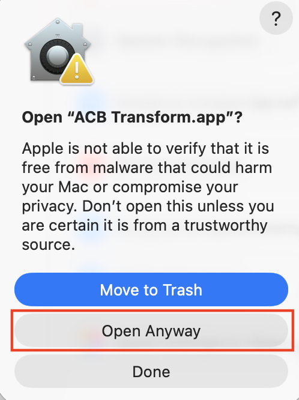

# Mac Install Instructions

ACB Transform is not currently Apple Developer ID signed or notarized. Because of that, macOS may block the app the first time you open it after downloading.

This warning does not mean the download is broken. It means Apple cannot verify the developer identity for this small-distribution build.

## Install

1. Download the correct Mac `.dmg` from the GitHub release.
   - Apple Silicon Macs: `arm64`
   - Intel Macs: non-`arm64`
2. Open the `.dmg`.
3. Drag **ACB Transform.app** into **Applications**.
4. Open **ACB Transform.app** from Applications.

If macOS blocks the app, continue with the steps below.

## Allow The App

When macOS shows this message, click **Done**.



Open **System Settings**, search for **security**, then open **Privacy & Security**. In the **Security** section, click **Open Anyway** beside the ACB Transform message.



macOS will ask for confirmation. Click **Open Anyway**.



The app should now open normally.

## Terminal Fallback

If the button does not appear in System Settings, run:

```bash
xattr -dr com.apple.quarantine "/Applications/ACB Transform.app"
open "/Applications/ACB Transform.app"
```

Only do this for the copy of ACB Transform downloaded from this project’s GitHub release.
